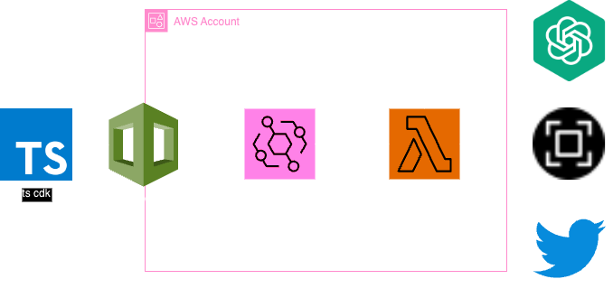

# 🤖 Serverless Twitter Bot

## 💡 About 
This is a small serverless application which utilizes
  - [twitter api](https://developer.twitter.com/en/docs/twitter-api)
  - [open ai api](https://openai.com/blog/openai-api)
  - [SourceCodeShots](https://sourcecodeshots.com/)
  - [AWS](https://docs.aws.amazon.com/) (Lambda, EventBridge, CDK)

to automatically post ai-generated tweets including code snippets as images on a cron based schedule. 



## 📋 Prerequisites

1. [AWS Account](https://www.googleadservices.com/pagead/aclk?sa=L&ai=DChcSEwjNxYba7Y-EAxVmimgJHS1hB50YABAAGgJ3Zg&ase=2&gclid=Cj0KCQiA5fetBhC9ARIsAP1UMgFteWsLlEHLo-27HTKxDBxVixblmyos-UXhPb3r2t3UQcTqCjaDN5MaAoQEEALw_wcB&ohost=www.google.com&cid=CAESVeD2FxKxom4E6UVWKv158_f0-uQYdKZLJ1Zm50ljGe6GXRSbW5UgZOhhDlhUrWIiBPvetbLOF4LlocjdkVd5C6i7RXf7L9HsiiPcTepP_T-cMp93Dws&sig=AOD64_2HiySYzy_TC285aWoiqTy_Wfj0pQ&q&nis=4&adurl&ved=2ahUKEwiTkIDa7Y-EAxW-YPEDHcHeDCAQ0Qx6BAgLEAE)
2. Twitter & Twitter developer account. Create a twitter app and make sure to store the `consumer-key`, `consumer-key-secret`, `access-key`, `access-key-secret` as AWS SSM Paramters at the respective path `/twitter-bot/twitter-client/[key-name]`
3. OpenAI api-key stored as a ssm parameter `/twitter-bot/openai-api-key`

## 🤔 How To Use

1. clone the project
  ```bash
  git clone https://github.com/timges/serverless-twitter-bot.git
  ```
2. login to aws by running 
  ```bash 
  aws configure
  ```
3. install dependencies
  ```bash 
  pnpm install
  ```
4. (optional): customize the prompts [here](src/handler/util/prompts.ts)
5. deploy to your aws account 
  ```bash
  npx cdk deploy
  ```
6. ✅ Done
